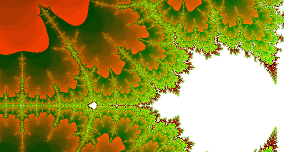
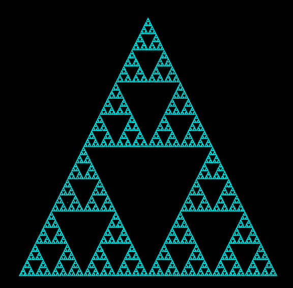

# Fractol

In this project I create all sorts of fractals. The main challenge I encountered was the optimization of the zooming into the fractal. I now make initial calculations for bigger squares first, reducing the amount of calculations necessary when zooming in. When the zooming stops, I render all intermediate pixels. When zooming with the mouse wheel, the zoom follows the position of the mouse exactly. This makes the experience quite nice.

## Different fractals
### Mandelbrot (1)
The fractal created by the Mandelbrot set is the best known fractal in the world. The Mandelbrot set consists of all complex numbers _c_ for which the function _fc(z) = z2 + c_ does not diverge, when iterated with initial _z = 0_. This set is completely black in the fractal. The colors signify the rate at which the numbers that are not in the set diverge. 

  

#### Controls
Move around: arrow keys or mouse drag and drop  
Zoom in and out: mouse wheel  
Color change: A, S, D, Z, X, C, or P for party mode!

### Julia (2)
The fractal created by the Julia set has many similarities to the Mandelbrot fractal. Here too, the colors signify the rate at which numbers diverge and numbers that are in the Julia set are black. The function that we use is also very similar, but the elements of the Julia set are the complex numbers _z_ for which the function _fc(z) = z2 + c_ does not diverge. This set is different for every complex number _c_, and therefore the image changes with _c_. We give the value for _c_ by moving the mouse on the screen.  

#### Controls
Same controls as the Mandelbrot set, except that moving the mouse on the screen changes the value of _c_. If you want to fix an image so you can zoom in on a specific point, you press the space bar.

### Sierpinski carpet (3)
Divide every square into nine smaller squares. Then remove the middle one of those nine. That's the idea behind the Sierpinski carpet. It may look like a disco floor, but it is a fractal in the way that if you zoom in on any part of the carpet, you see the carpet again.  

### Sierpinski triangle (4)
A very similar pattern to the Sierpinski carpet, but generated in a completely different way. I use a chaos game to generate this fractal, and therefore at first the triangle looks different every time I create it. Let it render for a while, though, and you can see the same pattern as the Sierpinski carpet, but then with squares. Pretty cool!

